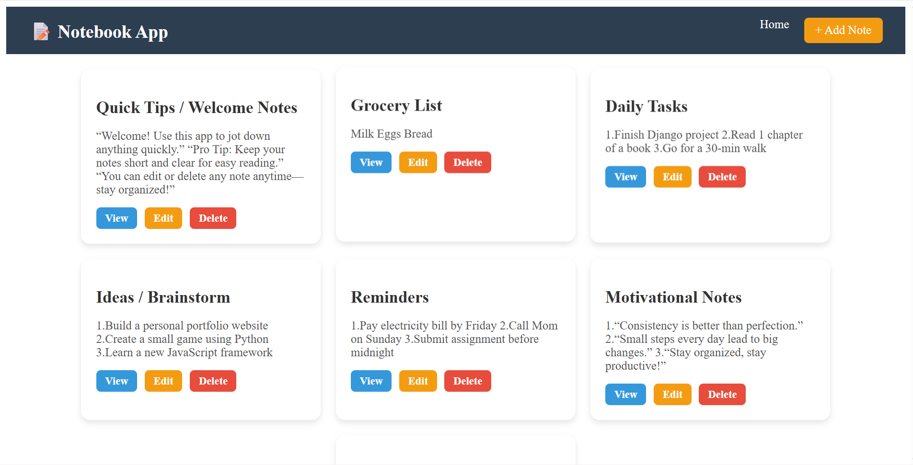
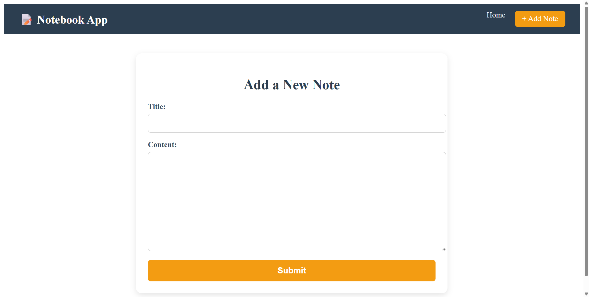
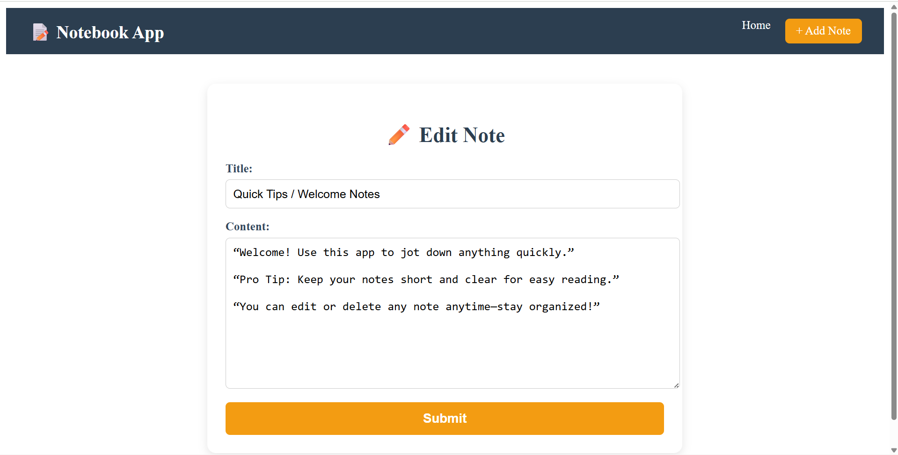
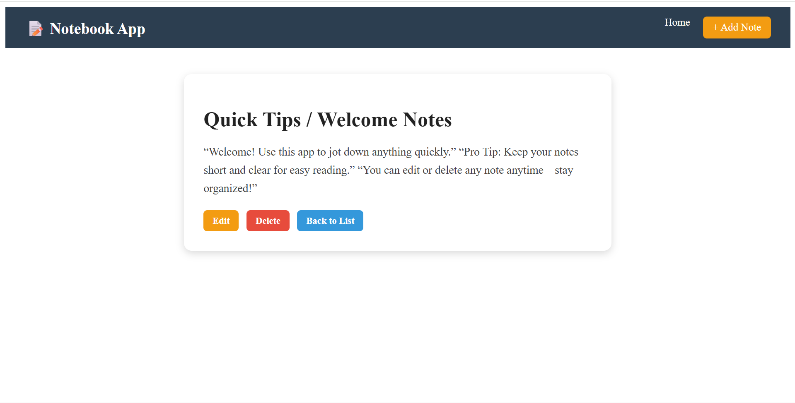
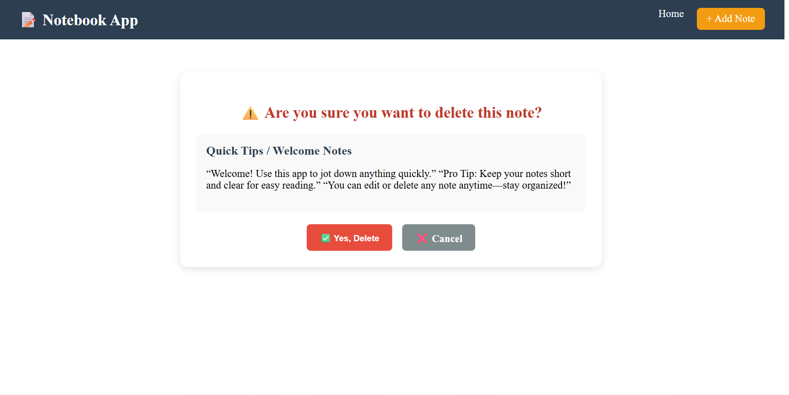

# Django Note App

A simple **Note App** built with Django that allows users to **create, view, edit, and delete notes**. The app has a clean interface and is easy to use for managing personal notes.

---

## **Features**

- **Homepage**: Displays all notes in a list/grid format.  
- **Add Note**: Create a new note with a title and content.  
- **Edit Note**: Update an existing note.  
- **Delete Note**: Remove a note permanently.  
- **View Note**: See the full details of a single note.  

---

## **Tech Stack**

- **Backend:** Python, Django  
- **Frontend:** HTML, CSS  
- **Database:** SQLite (default)  
- **Version Control:** Git & GitHub  

---

## **Screenshots**

### Homepage


### Add Note


### Edit Note


### View Note


### Delete Note


> ⚠️ Replace the above `assets/*.png` images with your own screenshots.

---

## **Installation**

1. **Clone the repository**
   ```bash
   git clone https://github.com/your-username/note-app.git
   cd note-app
